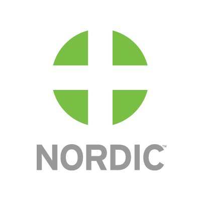
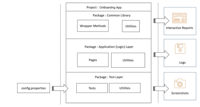

# NordicGlobal-test-automation-framework

This is a selenium automation repository that would allow QA Engineer to get up and running automated tests in ContractsApp with tools such as Java, Selenium and TestNG.

# How this framework works

## Tools used
1. Selenium 
1. Java 
1. TestNG

## How to Run

Instructions for running this framework

Download and Install Eclipse
In Eclipse, Go to File ->Import
Choose Existing Maven Projects and click in Next
Click in browse and select the folder
Click in finish
Right click on the project in eclipse
import selenium and testng .jar files in external jars section( if they are not there yet) the files are in the framework named by selenium-java-3.141.59.zip and testng-6.14.3.jar
To create a new run, you can right click in a test script in Test Folder, and click in convert to TestNG
Run the XML test file in Run_tests, change the credentials to yours
At the end, in reports folder, you can see the test result
